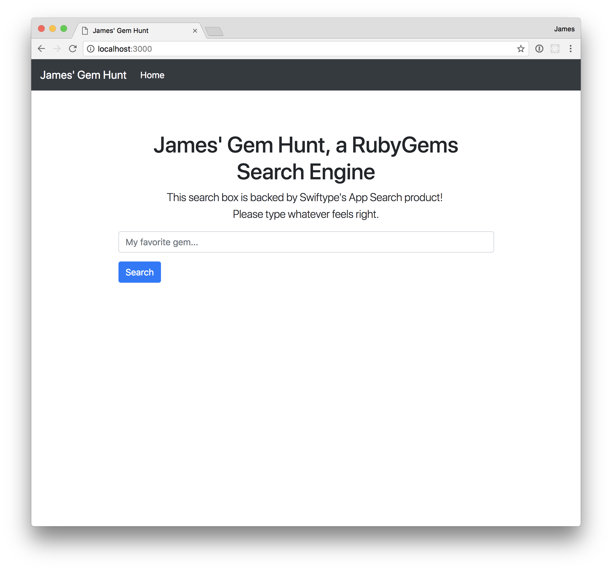
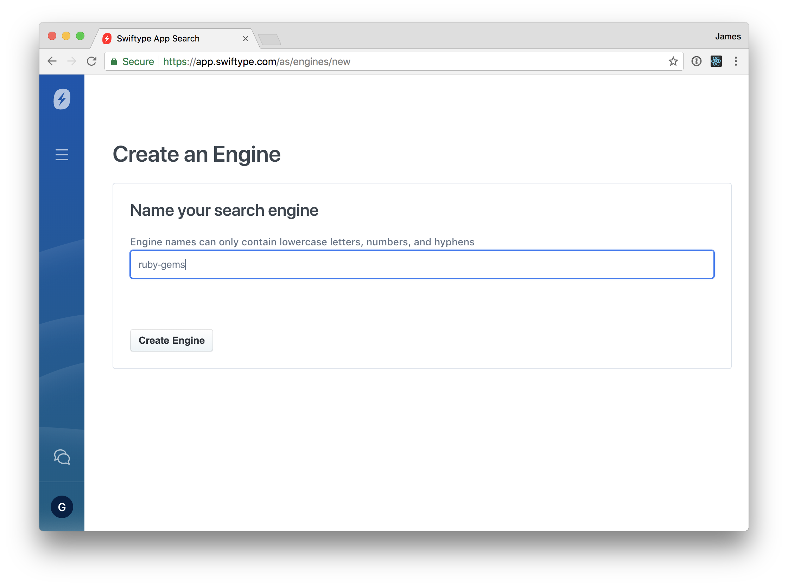
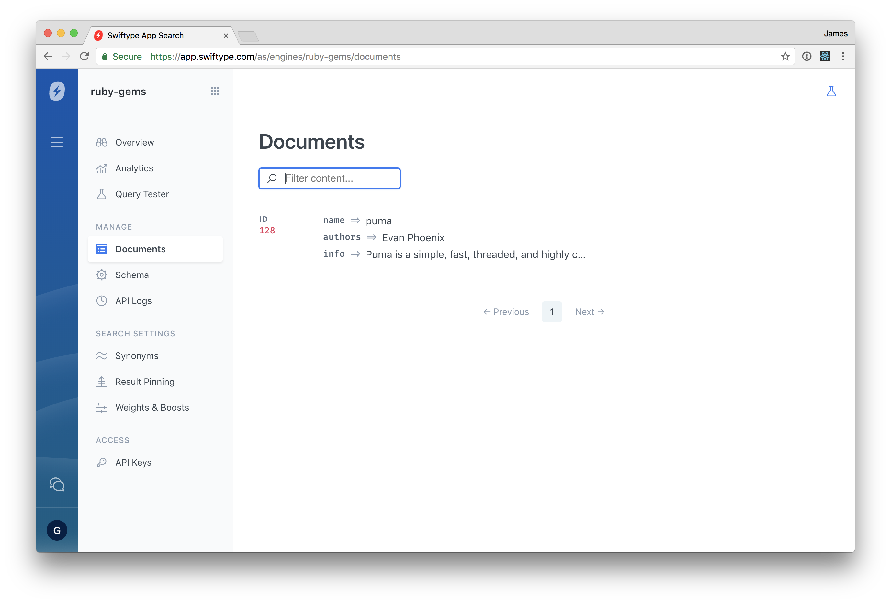
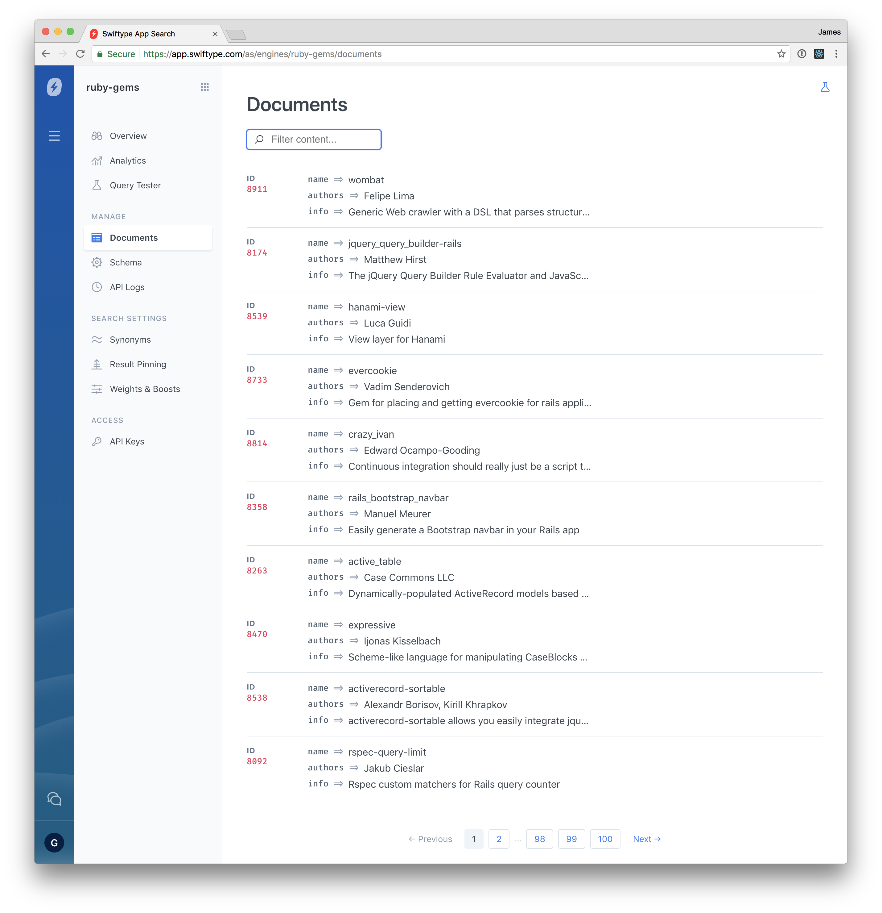

# App Search Rails Tutorial

This tutorial will guide you through adding a simple search feature to a Ruby on Rails application using Swiftype's App Search.

## Setup

To get started, simply clone this repository and run `bin/setup`. This will install bundler and the required gems, setup the SQLite database, and populate it with seed data.

```console
jgr@prompt:~$ git clone git@github.com:Swiftype/app-search-rails-tutorial.git
jgr@prompt:~$ cd app-search-rails-tutorial

jgr@prompt:~/app-search-rails-tutorial$ bin/setup
```

To make sure everything is in order, lets fire up the app with `rails server` and see what we're starting with.

```console
jgr@prompt:~/app-search-rails-tutorial$ rails server
=> Booting Puma
=> Rails 5.2.0 application starting in development
=> Run `rails server -h` for more startup options
Puma starting in single mode...
* Version 3.11.3 (ruby 2.5.1-p57), codename: Love Song
* Min threads: 5, max threads: 5
* Environment: development
* Listening on tcp://0.0.0.0:3000
Use Ctrl-C to stop
```

Once the server has started, open up your browser and navigate to [localhost:3000](http://localhost:3000), you should see something like this:



Great! We're done! Or are we? You may have noticed that the app currently returns every gem, regardless of what you enter in the search box. Let's see if we can improve our search results with App Search.

## Setup Swiftype App Search

Head on over to [Swiftype App Search](https://swiftype.com/app-search) and create a free trial account. Once you've created your account and logged in for the first time, be sure to click the **Access the Beta** button next to **Looking to try out App Search?**

Now it's time to create your first engine! An engine is primarily a repository for your indexed search records, but it also stores search analytics and any search configurations that you require. For the purposes of this tutorial, I suggest you name your engine **ruby-gems**.



## Install & Configure Swiftype App Search Client

Let's get the App Search client in our app so we can start working with it. Open up the `Gemfile`, and add:

```ruby
gem 'swiftype-app-search', '~> 0.1.1'
```

Then, run `bundle install` to install the gem.

```console
jgr@prompt:~/app-search-rails-tutorial$ bundle install
```

Finally, we're going to need our credentials so we can authorize ourselves to the Swiftype App Search API. Take a look at [your credentials on the App Search Dashboard](https://app.swiftype.com/as/credentials), and take note of your **Account Key** near the top, and your **api-key** (the part labelled **token**).

There are many different ways to keep track of API keys and other secret information in your development environment (The [dotenv gem](https://github.com/bkeepers/dotenv), for example), but for the purposes of this tutorial, we're going to go with a tried and true method...a yaml config file.

I've already provided you with `config/swiftype.yml` for the purpose, go ahead and open it now and fill it out with the **Account Key** and **api-key token** you found in the previous step.

```yaml
# config/swiftype.yml

app_search_account_key: host-c5s2mj # your Account Key
app_search_api_key: api-mu75psc5egt9ppzuycnc2mc3 # your API Key Token
```

Now lets add a simple initializer to load this configuration.

```ruby
# config/initializers/swiftype.rb

Rails.application.configure do
  swiftype_config = YAML.load_file(Rails.root.join('config', 'swiftype.yml'))

  config.x.swiftype.app_search_account_key = swiftype_config['app_search_account_key']
  config.x.swiftype.app_search_api_key = swiftype_config['app_search_api_key']
end
```

We're going to want to use this client in a few different places across the application, so lets wrap it in a small class.

```ruby
# app/lib/search.rb

class Search
  ENGINE_NAME = 'ruby-gems'

  def self.client
    @client ||= SwiftypeAppSearch::Client.new(
      account_host_key: Rails.configuration.x.swiftype.app_search_account_key,
      api_key: Rails.configuration.x.swiftype.app_search_api_key,
    )
  end
end
```

If you're using Spring (you probably are by default), you may need to restart the Spring preloader so that it notices the `app/lib` directory.

```console
jgr@prompt:~/app-search-rails-tutorial$ bundle exec spring stop
```

## Hook Into the Model Lifecycle

Now that we have an API client, it's time to start using it! Since the records in our Rails app are the "source of truth" for our ruby gems data, we'll want to update App Search on any changes that happen to them within our database. We're going to achieve this with ActiveRecord callbacks. Let's add an `after_commit` callback to notify App Search of any new records, or changes to existing records, and an `after_destroy` callback for when we remove a record.

```ruby
# app/models/ruby_gem.rb

class RubyGem < ApplicationRecord
  validates :name, presence: true, uniqueness: true

  after_commit do |record|
    client = Search.client
    document = record.as_json(only: [:id, :name, :authors, :info, :downloads])

    client.index_document(Search::ENGINE_NAME, document)
  end

  after_destroy do |record|
    client = Search.client
    document = record.as_json(only: [:id])

    client.destroy_documents(Search::ENGINE_NAME, [ document[:id] ])
  end

 # ...

end

```

One thing to note is that, for the purposes of this tutorial, we're making these calls from within the callback. Generally, you'd want to do the actual work of calling a third party service asynchronously, from within a job. This way requests to your application don't have to wait on their own requests to third party services. If you aren't familiar with asynchronous job services, take a look at the [ActiveJob](http://guides.rubyonrails.org/active_job_basics.html) framework provided by Rails.

Now, just to make sure things are working as expected, lets fire up a `rails console` and make a small change to a gem, and see that it is indexed.

```console
jgr@prompt:~/app-search-rails-tutorial$ rails console
# ...
irb(main):008:0> puma = RubyGem.find_by_name('puma')
=> # ...
irb(main):009:0> puma.info += ' Also, pumas are fast.'
=> # ...
irb(main):010:0> puma.save
=> true
```

After adding this little bit of editorial commentary, pop open your browser and take a look at the [documents panel in the App Search Dashboard](https://app.swiftype.com/as/engines/ruby-gems/documents). You should see a document that corresponds to the `puma` gem, your first indexed document!



Great! At this point we could just go through all of our records and force them to reindex by making small changes, but that might take awhile. Thankfully, the App Search API allows us to batch our index requests to index as many as 100 documents at a time.

## Index Records in Batches

If you're building App Search into an application from the start, you may not need to worry about indexing existing data, you could just let the `after_commit` hook above handle them as they come in. However, we already have more than 11,000 ruby gem records in our database! Let's write a rake task to index them all, 100 at a time.

```ruby
# lib/tasks/app_search.rake

namespace :app_search do
  desc "index every Ruby Gem in batches of 100"
  task seed: [:environment] do |t|
    client = Search.client

    RubyGem.in_batches(of: 100) do |gems|
      Rails.logger.info "Indexing #{gems.count} gems..."

      documents = gems.map {|gem| gem.as_json(only: [:id, :name, :authors, :info, :downloads]) }

      client.index_documents(Search::ENGINE_NAME, documents)
    end
  end
end
```

Lets run this now from the command line. Consider watching the log file in another terminal so you can see it in action (`tail -f log/development.log` works well for this purpose.)

```console
jgr@prompt:~/app-search-rails-tutorial$ rails app_search:seed
```

If you take another look at the [documents panel in the App Search Dashboard](https://app.swiftype.com/as/engines/ruby-gems/documents), you should see all of our documents are now indexed!



## Putting the Search in App Search

Now that we have all of our documents indexed in App Search, and are confident that they will stay up to date, lets actually use them to power our search! Let's open up the `RubyGemsController` and change the index action to use our App Search client.

```ruby
# app/controllers/ruby_gems_controller.rb

class RubyGemsController < ApplicationController

  PAGE_SIZE = 30

  def index
    if search_params[:q].present?
      @current_page = (search_params[:page] || 1).to_i

      search_client = Search.client
      search_options = {
        page: {
          current: @current_page,
          size: PAGE_SIZE,
        },
      }

      search_response = search_client.search(Search::ENGINE_NAME, search_params[:q], search_options)
      @total_pages = search_response['meta']['page']['total_pages']
      result_ids = search_response['results'].map {|rg| rg['id']['raw'].to_i }

      @search_results = RubyGem.where(id: result_ids).sort_by {|rg| result_ids.index(rg.id) }
    end
  end

  def show
    @rubygem = RubyGem.find(params[:id])
  end

  private

  def search_params
    params.permit(:q, :page)
  end
end
```

Head on over to [localhost:3000](http://localhost:3000) and enjoy your newly App-Search-ified Search Engine!

## A weighty consideration

As you tried out our improved Gem Hunt, you may have noticed that it still could use some improvement. For example, if you search for **rake**, the actual rake gem is the 14th result! Thankfully, App Search provides us with a way to configure our query to weight certain fields more heavily than others when computing search results. Let's more heavily weight the **name** field, so that searching for a gem by name results in it being much closer to the top, but leave the **info** and **authors** fields weighted at the default of `1.0`.

```ruby
# app/controllers/ruby_gems_controller.rb

# ...

def index
  if search_params[:q].present?
    @current_page = (search_params[:page] || 1).to_i

    search_client = Search.client
    search_options = {
      search_fields: {
        name: { weight: 2.0 },
        info: {},
        authors: {},
      },
      page: {
        current: @current_page,
        size: PAGE_SIZE,
      },
    }

    search_response = search_client.search(Search::ENGINE_NAME, search_params[:q], search_options)
    @total_pages = search_response['meta']['page']['total_pages']
    result_ids = search_response['results'].map {|rg| rg['id']['raw'].to_i }

    @search_results = RubyGem.where(id: result_ids).sort_by {|rg| result_ids.index(rg.id) }
  end
end

# ...
```

Note that if you provide the `search_fields` option to the searching API, you must include every field you would like to be included in the search. This is why we had to add **info** and **authors**, even though we wanted them to still be weighted at the default.

If you search again, rake should be the first result! If you're curious to read more about weights, check out the weights section of the [App Search searching guide](https://swiftype.com/documentation/app-search/guides/searching).

## Filtering to the top

App Search also allows you to specify filters to filter the search results returned. Let's add a filter to only show gems with over a million downloads.  First, lets add the checkbox to our form.

```ruby
# app/views/ruby_gems/index.html.erb

# ...

  <%= form_tag({}, {method: :get}) do %>
    <div class="form-group row">
      <%= text_field_tag(:q, params[:q], class: "form-control", placeholder: "My favorite gem...") %>
    </div>

     <div class="form-check">
       <%= check_box_tag('popular', 1, params[:popular], class: 'form-check-input') %>
       <label class="form-check-label" for="popular">Only include gems with more than a million downloads.</label>
     </div>

    <div class="form-group row">
      <%= submit_tag("Search", class: "btn btn-primary mb-2") %>
    </div>
  <% end %>

# ...
```

Now, back in the controller, lets add a filter to our search options based on the presence of the `:popular` parameter.

```ruby
# app/controllers/ruby_gems_controller.rb

  # ...

  def index
    if search_params[:q].present?
      @current_page = (search_params[:page] || 1).to_i

      search_client = Search.client
      search_options = {
        search_fields: {
          name: { weight: 2.0 },
          info: {},
          authors: {},
        },
        page: {
          current: @current_page,
          size: PAGE_SIZE,
        },
      }

      if search_params[:popular].present?
        search_options[:filters] = {
          downloads: { from: 1_000_000, to: 500_000_000 },
        }
      end

  # ...

  private

  def search_params
    params.permit(:q, :page, :popular)
  end

  # ...
```

Now try searching for a gem with fewer downloads, like **heyzap-authlogic-oauth**. With the checkbox unchecked, it's the first result! With it checked, we instead get gems with a wider audience, like **authlogic** and **oauth**.

## Recording Clickthroughs for Analytics

## Hungry for More?

Check out our other tutorials and guides on [the App Search Documentation page](https://swiftype.com/documentation/app-search/getting-started).


