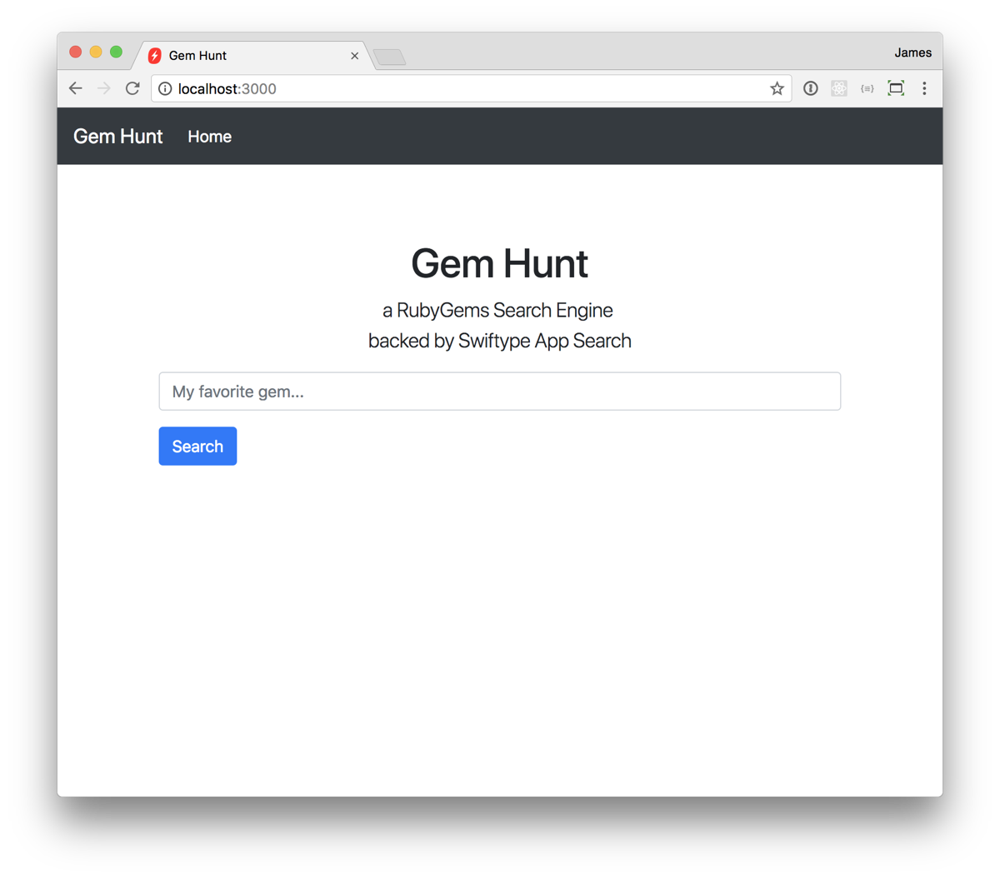

# App Search Rails Tutorial

This is the code repository for the [App Search Rails Tutorial](https://swiftype.com/documentation/app-search/tutorials/rails). To get started, clone this repository and follow along with the [instructions here](https://swiftype.com/documentation/app-search/tutorials/rails). If you'd rather just see the finished product, take a look at the [complete](https://github.com/swiftype/app-search-rails-tutorial/tree/complete) branch.

You should also check out our other tutorials and guides on [the App Search Documentation page](https://swiftype.com/documentation/app-search/getting-started)!

